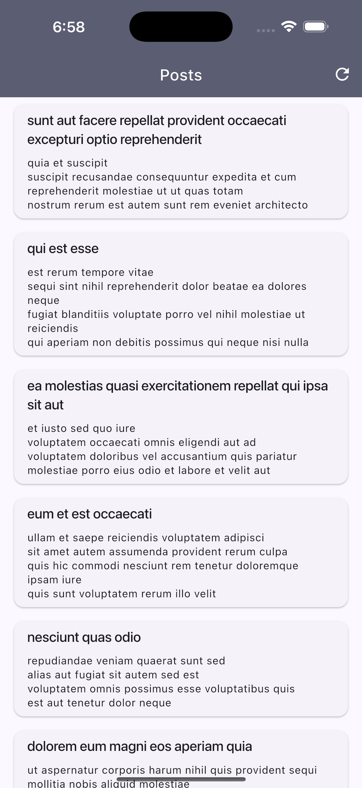

# flutter_posts_app

Flutter Posts App: Fetch, Store & Display

## Screenshots

## Objective

The goal of this task is to create a Flutter application that fetches posts from a public API, stores them locally using SQLite, and displays them in a user-friendly list format.

## Requirements

1. API Integration: Fetch data from the JSONPlaceholder API.
2. Local Storage: Save the fetched posts in an SQLite database using the sqflite package.
3. State Management: Use flutter_riverpod for managing state and riverpod_annotation for structured MVVM architecture.
4. User Interface: Display posts in a ListView, ensuring that:
 • Each item shows the title and body of the post.
 • Proper handling of null or empty values for id, title, and body.
 • The UI is clean and responsive.
5. Error Handling: Handle API failures, database errors, and empty data cases gracefully.

## Technology Stack

 1. Flutter: For building the UI.
 2. flutter_riverpod & riverpod_annotation: For state management in MVVM architecture.
 3. http: For making API requests.
 4. sqflite: For local database storage.
 5. fpdart: For functional error handling and better state flow.
